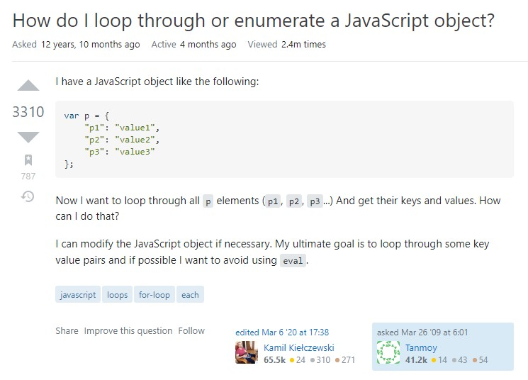

**Having the ability to ask smart questions is important** for software engineers. Since the field of computer science is always changing rapidly, it is difficult for any one person to know everything and nearly impossible to not have any questions. Asking questions helps software engineers better understand a concept that is needed to solve their problem at hand, so it is crucial they can ask questions effectively.

An example of a **smart question** can be seen [here](https://stackoverflow.com/questions/684672/how-do-i-loop-through-or-enumerate-a-javascript-object). This person asks how to loop through or enumerate a JavaScript object. The title of the form alone is clear, precise, and specific enough to let anyone coming across the form what the form is about. In the text of their form, they state that they have a JavaScript object, provide formatted code of the object and variable names, and state their goals. The text is concise and grammatically correct, so it is not bothersome for anyone to read. Additionally, they tag their post with relevant tags so it can be more easily found by others. Overall, the person communicated clearly and effectively their question and intentions, resulting in 42 answers and an upvote of 3,310 to their question.

On the other hand, a **not so smart question** can be seen [here](https://stackoverflow.com/questions/70872124/use-mutiple-accounts-in-truffle). The title of the form is not clear, only stating “Using multiple accounts in Truffle.” It is not specific. Afterward, their text body explains the person’s goals, however, there are grammatical errors and their text body is somewhat vague. There are enough details for a reader to grasp an idea of what the person would like to solve, creating multiple Truffle accounts to interact with a smart contract, but it is not in enough detail so the reader may have to make assumptions. Furthermore, the person asking the question bolds text that is not important. The use of bolding is to highlight a point and it is misused here. As a result, this post has two downvotes and no replies to their question.

This activity gave me more insight into asking questions on public forms that will have a better chance of getting a reply. The reading on Eric Raymond’s [How to ask questions the smart way](http://www.catb.org/esr/faqs/smart-questions.html) was especially helpful.
