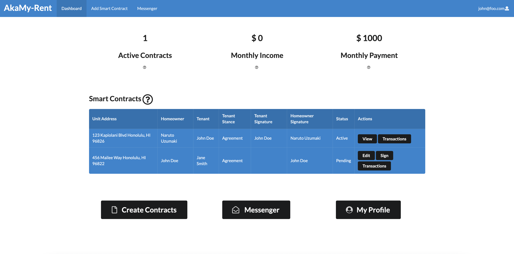
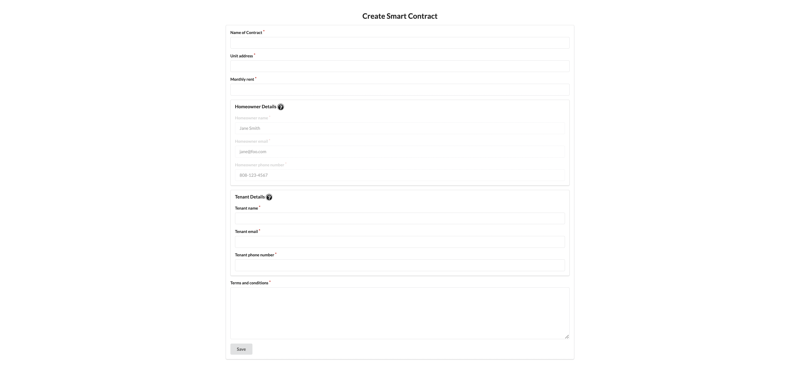
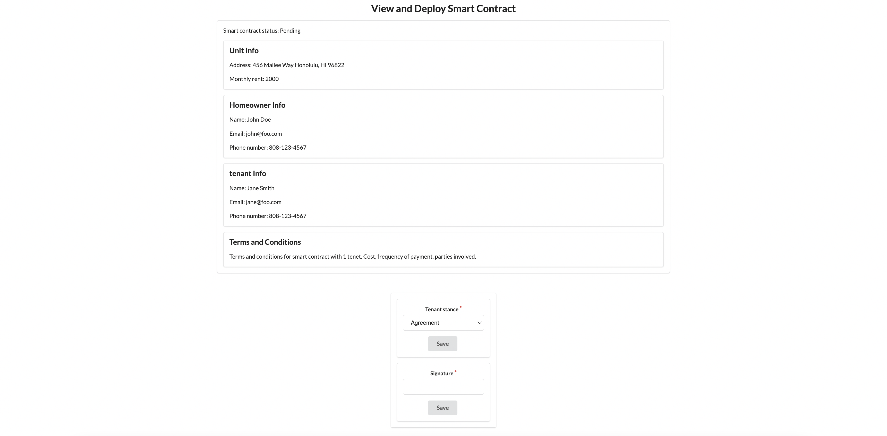

Housing for college students can be a stressful process. Since housing agreements tend to be shorter, homeowners can be more stressed having to find new tenants often. AkaMy-Rent hopes to provide a framework that allows rental agreements to be more accessible, easier to make, and provides a greater level of assurance to homeowners and tenants. Tenants can benefit by having an assured rental cost that won't go up as long as their contract is on the ethereum blockchain and homeowners can benefit by using the automated features of a smart contract to ensure payment is on time and in full. The progress of this project is the completion of all web development components from the creation of a smart contract draft to the signed agreement of both the homeowner and tenant. The incompleted parts are the deployment of the smart contract on the blockchain. This project was worked on by a 5-person team.

Given my background of no prior web development experience, this project applied many of the skills learned in class: creating pages, components, and MongoDB collections, modifying collections and displaying collections, limiting visibility to certain user types, and testing the functionality with TestCafe.

Specific functionalities are described below. Bolded statements are my contributions to the project.

- Landing page describing smart contracts
- New users can register for a new account
  - Accounts are stored in a MongoDB collection
- Log in and out of their account
- Edit account/profile details
- Learn about smart contracts
- **Navbar provides links to other pages**

- Dashboard shows important information
  - **View select smart contract information on the dashboard**
  - Number of active smart contracts
  - Monthly income and payment
  - **Links to edit/view smart contracts**
  - Transaction log

- **Create smart contract drafts (creators are the homeowners)**
  - **New smart contract drafts are saved to a MongoDB collection**
  - **The tenant can view the proposed smart contract on their account**
- **Edit smart contract drafts**
  - **Edit button link is only visible to homeowners of smart contracts**
  - **Only homeowners of smart contracts can edit smart contracts**

- **View smart contract drafts**
  - **Tenant only feature**
  - **Tenants can declare if they agree with the smart contract, which the homeowner will be able to see**
- **Sign smart contracts**
  - **Tenants and homeowners can electronically sign smart contracts**
  - **Signature must be the user’s full name**
  - **When both tenant and homeowner sign the smart contract, then the smart contract can be created in the blockchain (not implemented)**
- Transaction log of viewing past payments
- Messenger to contact other users

The code to the GitHub repository is [here](https://github.com/akamy-rent/akamy-rent).

