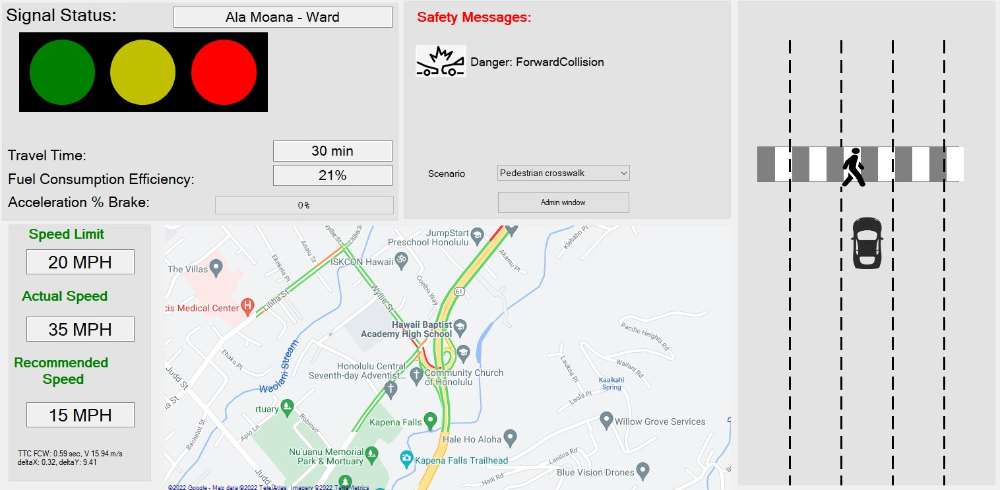
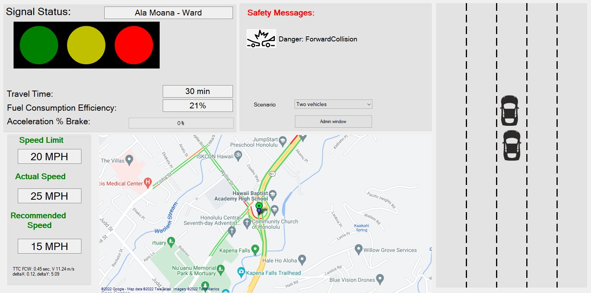

  
  

Traffic congestion on Nimitz Hwy and Ala Moana Blvd during traffic hours results in drivers sitting in their cars longer than they want to. The Nimitz Corridor V2X System will help prevent car, pedestrian, and cyclist collisions, speed guidance for optimum fuel efficiency based on the status of signals and car density at intersections ahead of the vehicle, and a real-time map reflecting signal status and the positions of all participating vehicles. Each participant will have a supported phone, app, and on board unit (OBU) device. This project is led by Dr. Guohui Zhang.

There are two major components to this project, the OBU client and OBU Server. The OBU client is the internal name for a process that runs in background and uses the services of the Signal Status (SS) server to constantly get up to date signal status information, and used to update the UHV2X map. OBU clients also constantly report vehicle position information to the SS server. The SS server runs on a Windows 10 server, physically located in the UH test lab, and directly connected to the NC high speed wired network.  The SS server maintains a database representing the current state of the NC, including the status of signals at all intersections and the location and movement of participating vehicles and non-participating V2X vehicles within it.

Currently, I am helping with the development of the OBU Client. I started with creating a stoplight visual to display the current signal status of the upcoming intersection, then creating a progress bar with percentage and color (red, green, yellow) indication for fuel efficiency. Afterward, I created lane arrows that indicate the real-time signal of their respective intersections along 34 intersections. Once this was finished, I went on to create the visual vehicle interface, which shows the host vehicle, any nearby participating vehicles, upcoming crosswalks and pedestrians, and lane markers that move depending on the driver's speed. I am still working on this section.

