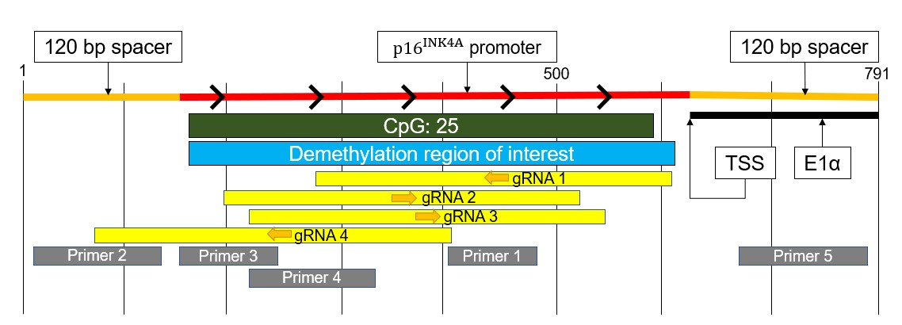

Inactivation of tumor suppressors occurs in many cancers due to not only genetic loss but also epigenetic silencing. If tumor suppressors are silenced by aberrant epigenetic modifications, it may be possible to reactivate dormant tumor suppressors by modulating epigenetic marks. DNA methylation at promoters inhibits transcription and can be found at tumor suppressor genes in cancers. Indeed, some skin cancers have inactivation of the p16 tumor suppressor gene due to promoter methylation. p16 is an important regulator of the cell cycle, and its loss leads to dysregulated cell cycle and tumor development. To investigate whether p16 can be reactivated by demethylating its promoter in cancer cells, we used a modified CRISPR-Cas9 system to edit the epigenome: deactivated Cas9 fused with TET1, a DNA demethylating enzyme. To recruit dCas9-TET1 to a specific genomic locus, we designed gRNAs targeting the p16 promoter. SKMEL-2 melanoma cell line has silenced p16 due to promoter methylation, and thus we transduced SK-MEL-2 cells with dCas9-TET1. Compared to negative control gRNA, cells with dCas9-TET1 and p16 promoter gRNA showed a trend toward decreased DNA methylation at the p16 promoter. Also, cells with p16 promoter gRNA had a trend toward increased p16 mRNA expression, but not p14 expression. Furthermore, cell proliferation may be inhibited by p16 promoter gRNA. Taken together, dCas9-TET1 targeting the p16 promoter may decrease DNA methylation, may increase p16 mRNA expression, and may inhibit cell proliferation. This study provides a basis for targeted DNA demethylation to reactivate dormant tumor suppressors and inhibit cancer phenotypes. Dr. Masoki Kawasumi provided guidance on this project.
